# 🚀 Deployment Setup Summary

## What Has Been Created

Your project is now ready for automated deployment to Hostinger! Here's what has been set up:

### 📁 Files Created

1. **GitHub Actions Workflow**
   - `.github/workflows/deploy.yml` - Automated deployment workflow
   - `.github/workflows/exclude-deploy.txt` - Files to exclude from deployment
   - `.github/workflows/README.md` - Workflow documentation

2. **Deployment Scripts**
   - `deploy.sh` - Manual deployment script (executable)

3. **Environment Configuration**
   - `.env.production.example` - Production environment template
   - `UI/src/environments/environment.prod.ts` - Angular production config

4. **Documentation**
   - `HOSTINGER_DEPLOYMENT.md` - Complete deployment guide (detailed)
   - `DEPLOYMENT_QUICK_START.md` - Quick 5-step guide
   - `DEPLOYMENT_CHECKLIST.md` - Step-by-step checklist
   - `DEPLOYMENT_SUMMARY.md` - This file

---

## 📚 Documentation Guide

### For First-Time Deployment
Start here: **[DEPLOYMENT_QUICK_START.md](DEPLOYMENT_QUICK_START.md)**
- 5-step fast track
- Takes ~15 minutes
- Perfect for getting started

### For Complete Reference
See: **[HOSTINGER_DEPLOYMENT.md](HOSTINGER_DEPLOYMENT.md)**
- Comprehensive guide
- Troubleshooting section
- Maintenance guidelines
- Backup strategies

### For Task Tracking
Use: **[DEPLOYMENT_CHECKLIST.md](DEPLOYMENT_CHECKLIST.md)**
- Printable checklist
- Nothing gets missed
- Perfect for team coordination

### For GitHub Actions
Read: **[.github/workflows/README.md](.github/workflows/README.md)**
- Workflow customization
- Secret configuration
- Troubleshooting workflows

---

## 🎯 Quick Start Path

### Option A: Automated Deployment (Recommended)

```mermaid
graph LR
    A[1. Setup Hostinger] --> B[2. Configure GitHub Secrets]
    B --> C[3. Update Environment Files]
    C --> D[4. Initial Server Setup]
    D --> E[5. Push to GitHub]
    E --> F[🎉 Auto-Deploy!]
```



**Time Required:** ~15-20 minutes

**Steps:**
1. Follow [DEPLOYMENT_QUICK_START.md](DEPLOYMENT_QUICK_START.md)
2. Configure GitHub secrets
3. Push code to main branch
4. Deployment happens automatically!

**Best For:**
- Continuous deployment
- Team collaboration
- Production environments

---

### Option B: Manual Deployment


**Time Required:** ~30 minutes

**Steps:**
```bash
# 1. Run deployment script
./deploy.sh production

# 2. Upload generated .tar.gz file to Hostinger

# 3. Follow UPLOAD_INSTRUCTIONS.txt in the package
```

**Best For:**
- One-time deployments
- Testing deployments
- No GitHub Actions preference

---

## ⚙️ Configuration Required

### Before You Start

Update these files with your actual domain:

1. **`UI/src/environments/environment.prod.ts`**
   ```typescript
   // Change this:
   host: "https://app.yourdomain.com/"

   // To your actual subdomain:
   host: "https://app.youractual domain.com/"
   ```

2. **`.env` on server**
   ```env
   APP_URL=https://app.youractualdomain.com
   DB_DATABASE=/home/yourusername/public_html/app/database/database.sqlite
   MAIL_USERNAME=noreply@youractualdomain.com
   ```

3. **GitHub Secrets**
   - All the FTP/SSH credentials
   - See [DEPLOYMENT_QUICK_START.md](DEPLOYMENT_QUICK_START.md) section 2

---

## 🔑 GitHub Secrets Needed

| Secret | Where to Get It |
|--------|----------------|
| `FTP_SERVER` | Hostinger hPanel → FTP Accounts |
| `FTP_USERNAME` | Hostinger hPanel → FTP Accounts |
| `FTP_PASSWORD` | Hostinger hPanel → FTP Accounts |
| `SSH_HOST` | Hostinger hPanel → SSH Access |
| `SSH_USERNAME` | Hostinger hPanel → SSH Access |
| `SSH_PASSWORD` | Hostinger hPanel → SSH Access |
| `SSH_PORT` | Usually `65002` for Hostinger |
| `DEPLOY_PATH` | Run `pwd` in SSH, usually `/home/user/public_html/app` |

---

## 📋 Pre-Flight Checklist

Before deploying, ensure:

- [ ] ✅ Hostinger account ready
- [ ] ✅ Subdomain created and configured
- [ ] ✅ PHP 8.2+ enabled
- [ ] ✅ SSH access enabled
- [ ] ✅ FTP credentials available
- [ ] ✅ GitHub repository created
- [ ] ✅ Code pushed to GitHub
- [ ] ✅ All secrets configured
- [ ] ✅ Environment files updated
- [ ] ✅ Application works locally

---

## 🚦 Deployment Methods Comparison

| Feature | Automated (GitHub Actions) | Manual (deploy.sh) |
|---------|---------------------------|-------------------|
| **Setup Time** | 15-20 min (one-time) | 5 min per deploy |
| **Deploy Time** | ~3-5 min | ~10-15 min |
| **Trigger** | Git push | Run script |
| **Best For** | Production, Teams | Testing, One-off |
| **Rollback** | Git revert + push | Manual |
| **Logs** | GitHub Actions UI | Terminal output |
| **Cost** | Free (GitHub) | Free |

---

## 📊 Deployment Workflow

### Automated Deployment Flow

```
Developer                     GitHub                    Hostinger
    |                            |                          |
    |-- Push to main ----------->|                          |
    |                            |                          |
    |                       [Workflow Runs]                 |
    |                            |                          |
    |                      [Build Backend]                  |
    |                      [Build Frontend]                 |
    |                      [Create Package]                 |
    |                            |                          |
    |                            |-- Deploy via FTP ------->|
    |                            |                          |
    |                            |-- SSH Commands --------->|
    |                            |                     [Migrations]
    |                            |                     [Cache Clear]
    |                            |                          |
    |<-- Deployment Success -----|<-- Complete -------------|
```

---

## 🔍 What Happens During Deployment

### Backend Processing
1. ✅ PHP 8.2 environment setup
2. ✅ Composer dependencies installed (production only)
3. ✅ Laravel files prepared
4. ✅ Environment configured

### Frontend Processing
1. ✅ Node.js 20 environment setup
2. ✅ NPM dependencies installed
3. ✅ Angular app built for production
4. ✅ Assets optimized and minified

### Deployment Package
1. ✅ Laravel + Angular combined
2. ✅ Unnecessary files excluded
3. ✅ Permissions set correctly
4. ✅ .htaccess configured

### Server Setup
1. ✅ Files uploaded via FTP
2. ✅ Laravel cache regenerated
3. ✅ Routes cached
4. ✅ Configurations optimized

---

## 🎯 Success Metrics

After deployment, you should see:

| Checkpoint | Expected Result |
|-----------|----------------|
| **API Health** | `https://app.yourdomain.com/api/health` returns 200 OK |
| **Frontend** | `https://app.yourdomain.com/app` loads without errors |
| **Login** | Users can authenticate successfully |
| **Console** | No JavaScript errors (F12 → Console) |
| **HTTPS** | Green padlock in browser |
| **Performance** | Page loads in < 3 seconds |

---

## 🆘 Getting Help

### If Something Goes Wrong

1. **Check the documentation**
   - Start with [DEPLOYMENT_QUICK_START.md](DEPLOYMENT_QUICK_START.md)
   - Troubleshooting section in [HOSTINGER_DEPLOYMENT.md](HOSTINGER_DEPLOYMENT.md)

2. **Check the logs**
   ```bash
   # Laravel logs
   tail -f storage/logs/laravel.log

   # Web server logs
   tail -f ~/logs/error_log
   ```

3. **Check GitHub Actions**
   - Go to Actions tab
   - View workflow logs
   - Look for red ❌ marks

4. **Common fixes**
   ```bash
   # Reset permissions
   chmod -R 755 storage bootstrap/cache

   # Clear all cache
   php artisan cache:clear
   php artisan config:clear
   php artisan view:clear

   # Rebuild cache
   php artisan config:cache
   php artisan route:cache
   ```

### Support Resources

- **Hostinger Support**: https://www.hostinger.com/tutorials
- **Laravel Docs**: https://laravel.com/docs/11.x
- **Angular Docs**: https://angular.io/docs
- **GitHub Actions**: https://docs.github.com/en/actions

---

## 📈 Next Steps After Deployment

1. **Set up monitoring**
   - Configure uptime monitoring
   - Set up error tracking

2. **Enable backups**
   - Set up automated backups
   - Test backup restoration

3. **Performance optimization**
   - Enable caching
   - Optimize images
   - CDN integration (optional)

4. **Security hardening**
   - Review SSL configuration
   - Set up security headers
   - Configure rate limiting

5. **Team onboarding**
   - Share deployment docs
   - Set up access controls
   - Document procedures

---

## 🎉 Ready to Deploy?

### For Automated Deployment
👉 Start with: **[DEPLOYMENT_QUICK_START.md](DEPLOYMENT_QUICK_START.md)**

### For Manual Deployment
👉 Run: `./deploy.sh production`

### Need More Details?
👉 Read: **[HOSTINGER_DEPLOYMENT.md](HOSTINGER_DEPLOYMENT.md)**

---

## 📝 Deployment Timeline

**Expected Timeline for First Deployment:**

| Phase | Time Required |
|-------|--------------|
| Hostinger Setup | 10 minutes |
| GitHub Configuration | 5 minutes |
| Environment Setup | 10 minutes |
| Initial Server Setup | 15 minutes |
| First Deployment | 5 minutes |
| Testing & Verification | 10 minutes |
| **Total** | **~55 minutes** |

**Subsequent Deployments:**
- Automated: ~3-5 minutes (just git push!)
- Manual: ~10-15 minutes

---

**Good luck with your deployment! 🚀**

If you encounter any issues, remember:
1. Check the docs
2. Check the logs
3. Check the checklist
4. Breathe and try again!

*Documentation last updated: December 2024*
